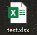

# Python 解密亿赛通加密文件

## 概述

很多小伙伴在看到亿赛通加密系统5.0的时候，想必非常头疼，Excel，word，PPT文件全部会被加密，打上一把黄色的锁（如下图），今天分享一下关于如何解密亿赛通加密系统文件。如何在本地电脑解密的方法！此方法需要使用到的工具是Python语言，用到的第三包有Django，项目运行前的环境配置，以下环境需你自己安装解决。

1. 安装好python安装包
2. 安装Django第三方包
 
   
 

## 解密步骤
### 一、github下载源码到本地，并解压。
### 二、在电脑运行里输入cmd，弹出命令框，输入如下代码
	cd "代码所在的文件夹路径/Decrypt_Test"
	python manage.py runserver 127.0.0.1:8000
### 三、浏览器进入网址：http://127.0.0.1:8000/decrypt
浏览器输入网址后，如下图：选择需要解密的文件，点击上传并解密。解密后的文件默认存放在"E:\"根目录下。
	
 

## 解密操作视频地址

## 关注公众号
欢迎大家关注公众号：Python利剑，公众号文章里面为大家详细介绍解密原理。

